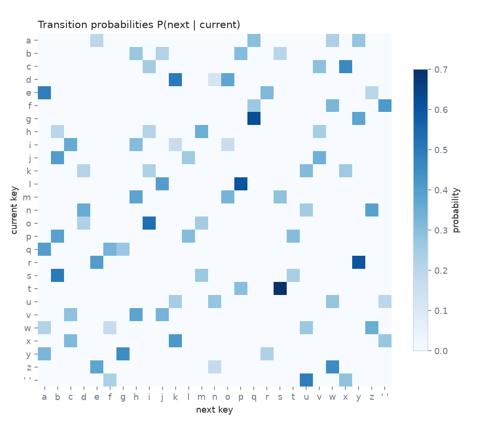
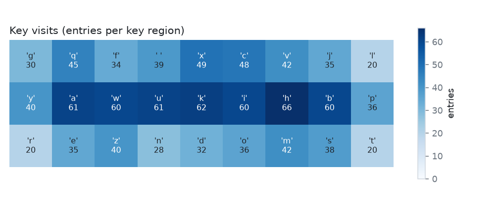
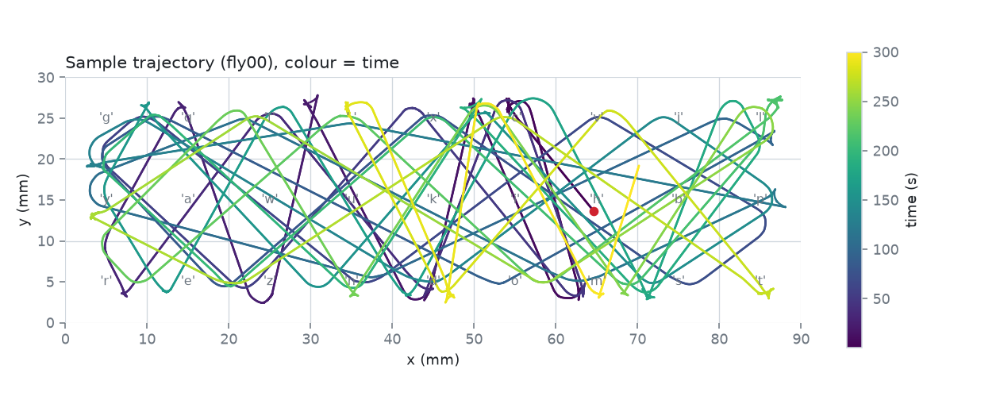

# FlyHamlet

The FlyWire fruit-fly connectome (v783, 139,255 neurons, 15.1 M connections, 54.5 M synapses)
run as a leaky integrate-and-fire network, dropped into a 2D arena that doubles as a
typewriter, and used for two experiments: how much entropy does the typing have, and can the
brain serve as an entropy source that eventually types Hamlet?

> **Where the randomness comes from.** The wiring is deterministic and the network is silent
> at rest: with no input and no noise, no neuron ever spikes and two runs are identical. Every
> bit of randomness in the keystroke logs and in the entropy-source experiment comes from the
> **injected Poisson background drive and the stochastic arena (looming) inputs**, seeded from
> `config.yaml`, not from the connectome itself. The brain shapes and mixes that noise; it does
> not create it.

## Live browser sessions and replay viewer

GitHub Pages opens a fresh browser simulation of the **full** FlyWire v783 network,
with all 139,255 neurons and 15,091,983 connected pairs. The initial visit downloads
48.5 MB of compressed wiring data; a Web Worker computes new spikes, sensorimotor
activity, movement, and keystrokes without a server. **New session** resets neural
state and chooses a new cryptographically generated 32-bit seed. Pause/resume,
target speed, and the trajectory trail work during live sessions. The display shows
simulated time and the actual simulation-to-wall-time ratio; full-network computation
may run slower than real time. Background tabs pause the session.

The browser model (`site/live-model.js`) ports the Python LIF equations, float32
arithmetic, update order, signed synapses, delays, refractory behavior, arena controller,
and key-region rules. It skips resting neurons and exact floating-point fixed points
without removing neurons or connections. Its xoshiro128** random stream reproduces
browser sessions by seed but differs from NumPy PCG64, so identical seed numbers do
not reproduce the historical Python trajectories. The hovering artwork is a visual
interpretation of the model’s walking trajectory.

Four saved 300-second runs remain available in the **Session** menu. These load
`site/data/flyNN.json` and retain playback speed and scrubbing. Live sessions never
load those trajectory files. Both modes share the keyboard, manuscript, neural
readouts, and rolling chart. Reduced-motion preferences disable autoplay and
cosmetic movement. Space toggles pause/resume when focus is outside a control.

The **[Learning lab](https://quadrin.github.io/FlyHamlet/learn.html)** runs a separate,
live two-letter benchmark with a supervised decoder and explicit key presses.
Its protocol and limits are described in [Experiment 3](#experiment-3-two-letter-learning).
The **[Phrase recall lab](https://quadrin.github.io/FlyHamlet/recall.html)** adds a
separate sequence-memory benchmark, described in [Experiment 4](#experiment-4-phrase-recall).
The **[Memory lab](https://quadrin.github.io/FlyHamlet/memory.html)** measures
post-cue neural information without external history ([Experiment 5](#experiment-5-neural-memory)).
The **[Sequence lab](https://quadrin.github.io/FlyHamlet/sequence.html)** asks whether the
order of two letters can be read from one snapshot of neural state after the input
has stopped ([Experiment 6](#experiment-6-two-letter-state-decoding)).
The **[Chain lab](https://quadrin.github.io/FlyHamlet/chain.html)** gives the network one
prompt and feeds its own decoded letters back as cues, with nothing stored outside
its state ([Experiment 7](#experiment-7-self-driven-recall)).

Locally, run `python -m http.server` in the repository root and open `/index.html`.
The viewer templates are `site/head.html` and `site/body.html`; styling and orchestration
are `site/style.css` and `site/replay.js`. Run `python scripts/build_site.py` after
editing the templates. UI-only rebuilds reuse committed data and require no pandas.

To regenerate the full browser wiring export from the public release tables:

```bash
python scripts/export_browser_connectome.py
node --test tests/test_live_model.cjs
```

`site/model/manifest.json` records the exact configuration, target neuron indices,
key layout, source URLs and SHA-256 hashes. The worker checks the decompressed
array hashes before starting a session. Python simulation remains available through
`flyhamlet/run_flies.py`, with `--live` for its matplotlib viewer.

## Layout

```
config.yaml              every gain, rate, path and seed
flyhamlet/data.py        Phase 0: download + cache the Codex v783 tables, build the Connectome
flyhamlet/sim.py         Phase 1: sparse LIF network (numba / numpy / torch backends), input + spike APIs
flyhamlet/validate.py    Phase 1: sugar GRN -> MN9 validation against Shiu et al. 2024
flyhamlet/arena.py       Phase 2: arena, DN motor readout, looming input
flyhamlet/typewriter.py  Phase 2: 3x9 key grid, keystroke log
flyhamlet/run_flies.py   Phase 2: N flies in parallel (optional --live matplotlib view, --tap)
flyhamlet/entropy_tap.py Phase 3: stream inter-spike intervals of a tapped neuron set to disk
analysis/entropy.py      Experiment 1: entropies, null models, Hamlet scoring, report + PNGs
analysis/whiten.py       Experiment 2: 64 ISIs -> SHA-256 -> rejection-sampled keys
analysis/typist.py       Experiment 2: longest Hamlet substring via a suffix automaton
analysis/entropy_tests.py Experiment 2: NIST SP 800-90B MCV + collision estimates, dieharder output
scripts/                 download_data.py, benchmark.py, benchmark_brian2.py, run_experiment{1,2}.sh, benchmark_{learning,recall,memory,sequence}.cjs, build_site.py
tests/                   unit tests (simulator vs Brian2, estimators, whitening, typist, tap)
docs/                    phase notes (DN screen)
results/                 validation, benchmark, arena logs, experiment reports
```

## Setup

```bash
pip install -r requirements.txt
python scripts/download_data.py      # ~280 MB from the public flywire-data bucket, then builds data/cache
python -m pytest -q                  # 34 tests, ~15 s, no data download needed
```

## Phase 0: data

The public v783 release tables are served by Codex from
`https://storage.googleapis.com/flywire-data/codex/data/fafb/783/` (the download page on
codex.flywire.ai needs a Google login; the bucket does not). Files used: `neurons.csv.gz`
(neurotransmitter predictions), `connections_no_threshold.csv.gz` (every synapse, no per-pair
threshold: this is exactly the 15,091,983-pair table Shiu et al. used for v783),
`classification_with_fw_and_hemibrain_types.csv.gz`, `consolidated_cell_types.csv.gz`,
`labels.csv.gz`, `names.csv.gz`.

`python -m flyhamlet.data` prints:

```
neurons: 139,255   connected pairs: 15,091,983   synapses: 54,492,922
nt: ACH=90,692 GLUT=24,854 GABA=19,176 SER=2,113 UNK=1,250 DA=935 OCT=235
sign: +1 = 95,225   -1 = 44,030
super_class: optic=77,536 central=32,388 sensory=16,903 visual_projection=8,053 ascending=2,362 descending=1,303 ...
```

Neurons without a prediction in `neurons.csv` (18,408) take the synapse-weighted majority
neurotransmitter of their output connections. Sign: ACh, DA, OCT, SER excitatory; GABA and
glutamate inhibitory (Shiu et al.). `Connectome.neurons_of_type`, `search_types` and
`search_labels` look names up in the annotation tables; nothing is addressed from memory.

## Phase 1: simulator

Shiu et al. 2024 (Nature, *A Drosophila computational brain model reveals sensorimotor
processing*) parameters, taken from their public Brian2 model (`philshiu/Drosophila_brain_model`):

| parameter | value |
|---|---|
| resting / reset / threshold | -52 / -52 / -45 mV |
| membrane / synaptic time constant | 20 / 5 ms |
| refractory period, synaptic delay | 2.2 ms, 1.8 ms |
| weight per synapse | 0.275 mV, connection weight = sign(pre) x synapse count x 0.275 mV |
| timestep | 0.1 ms (Brian2 default clock) |
| activation | Poisson events adding 68.75 mV to v (forces one spike per event), no refractory period on activated neurons |

The two linear ODEs are integrated exactly per step. Update order follows Brian2's schedule
(state update, threshold, synapses + Poisson, reset), and, as in Brian2, synaptic input that
arrives while the postsynaptic neuron is refractory is discarded. The implementation was
verified spike-for-spike against Brian2 2.9 on deterministic chains (`tests/test_sim.py`,
`tests/data/brian2_chain_*.json`); getting the refractory-input rule right moved the full-network
comparison from r = 0.95 to r = 0.99 (see below).

**Backends.** A custom sparse implementation: state updates are fused numba loops
(parallel over neurons) and spike delivery walks the CSR rows of the spiking neurons only;
the same algorithm exists in numpy and in PyTorch (for a GPU). All three produce bit-identical
spike trains on CPU. No GPU was available here, so the torch path is only timed on CPU.
`results/benchmark/benchmark.md` (4 CPU cores, 20 sugar GRNs driven at 150 Hz, 1 s simulated):

| backend | x real time |
|---|---|
| numba | ~3-4x |
| numpy | ~11x |
| torch (CPU) | ~40x |
| Brian2 (authors' model, cython) | ~70x |

**Determinism.** With no input and no background noise the network is at rest and no spike
ever occurs. All stochastic inputs draw from one `numpy.random.Generator(seed)`; same seed,
same inputs, same backend => identical spikes.

**APIs** (`flyhamlet/sim.py`): `inject_current(target, mV)`, `inject_poisson(target, rate_hz,
weight_mV, to='v'|'g')`, `set_background(rate_hz, weight_mV, target)`, `silence(target)`,
`subscribe(target, callback)` (per-timestep spike delivery), `step()`, `run()`. Targets are cell
type names, root-id lists, label regexes, super classes or index arrays.

**Validation** (`python -m flyhamlet.validate`, `results/validation/report.md`): the 20
labellar sugar GRNs of Shiu et al. that exist in v783 are driven at 10-200 Hz; the contralateral
MN9 fires from 25 Hz drive upward, MN6 and MN8 join at higher drive, the responder count is in
the low hundreds, and per-neuron rates match the authors' own Brian2 model run on the same
v783 tables with Pearson r = 0.987-0.998:

| GRN rate (Hz) | MN9 contra ours | MN9 contra Brian2 | responders ours / Brian2 | r |
|---|---|---|---|---|
| 50 | 10.2 | 14.5 | 289 / 276 | 0.987 |
| 100 | 62.8 | 62.0 | 374 / 366 | 0.994 |
| 150 | 79.2 | 88.5 | 393 / 385 | 0.996 |
| 200 | 90.2 | 90.0 | 430 / 415 | 0.998 |

## Phase 2: arena and typewriter

See `docs/phase2_dn_screen.md` for the annotation check and the looming screen that chose the
readout. Turning = `turn_gain` x (left - right) rate of DNa02 + DNa01 (both respond to
contralateral looming, so the fly turns away from walls); speed = `base_speed` + `speed_gain` x
DNp09 - `backward_gain` x MDN (moonwalker DNs drive backward walking). Walls within
`wall_distance_mm` drive that eye's LC4 + LPLC2 with proximity-scaled Poisson input. The arena
(90 x 30 mm) is a 3 x 9 grid of keys, letters assigned by a seeded permutation; a keystroke is
logged only when the fly enters a new key region (`sim_time_s,key_index,letter,x,y,heading_deg`).

```bash
python -m flyhamlet.run_flies --n-flies 4 --duration 300 --procs 4   # headless, seeds 42..45
python -m flyhamlet.run_flies --n-flies 1 --live                      # matplotlib live view
```

## Experiment 1: typing entropy

```bash
scripts/run_experiment1.sh          # or: python analysis/entropy.py --out results/entropy_exp1
```

Results (`results/entropy_exp1/report.md`; 4 flies x 300 s, seeds 42-45, 1,139 keystrokes,
0.95 keystrokes/s, no wall contact):

| bits per keystroke | fly typist | uniform grid walk (null) | uniform 27-key typist (null) |
|---|---|---|---|
| H0 marginal (Miller-Madow) | 4.70 | 4.73 | 4.75 |
| H(X_t+1 \| X_t) | 1.65 | 1.67 | 4.75 |
| LZ76 rate, length-matched | 1.89 | 2.45 | 4.16 |

All 27 keys are visited, the transition graph is one strongly connected component and has no
absorbing key. The marginal is nearly uniform but the conditional entropy is that of a random
walk on the grid: because a keystroke is only logged when the fly *enters* a region, consecutive
keys must be neighbours, and the LZ76 rate (1.89 bits) is below the grid walk's (2.45) because the
fly walks in long straight lines and reverses, which is more predictable than a random walk.

Hamlet (167,325 characters after cleaning) uses 468 distinct letter pairs; under this key layout
only 105 of them are grid-adjacent, so P(Hamlet) = 0 for *any* fly on this typewriter, not just
this one. The fitted model has 414 zero-probability pairs (150,475 of Hamlet's 167,324
transitions), listed with their Hamlet frequencies in the report. With Laplace smoothing the
expected number of keystrokes is ~10^313493, versus 27^len = 10^239503 for the uniform typist.





## Experiment 2: fly brain as entropy source

```bash
scripts/run_experiment2.sh          # tapped flies -> whiten -> typist -> NIST tests + dieharder files
```

The tap samples 500 central-brain neurons (seeded; the list is dumped next to the ISI file)
that are neither of the wired sensory/motor types nor their direct synaptic partners, and
streams `(neuron, ISI in timesteps)` records to a binary file. `analysis/whiten.py` hashes
batches of 64 ISIs with SHA-256 and turns bytes into keys by rejection sampling (bytes >= 243
rejected, then mod 27); raw ISIs are never used mod 27. `analysis/typist.py` streams the keys
through a suffix automaton of Hamlet and reports the longest Hamlet substring ever produced.
`analysis/entropy_tests.py` gives the NIST SP 800-90B most-common-value and collision
min-entropy estimates on the raw ISIs and writes raw and whitened 32-bit streams for
`dieharder -g 201 -f <file>`.

Results (`results/entropy_exp2/report.md`; 4 flies x 120 s, background 200 Hz x 4 mV, 500 tapped
neurons per fly of which ~430 fire, median 2.6 Hz): 3,603,323 raw ISIs -> 56,301 SHA-256 batches
-> 1,709,435 keys (accept fraction 0.949).

| data | NIST 800-90B estimator | min-entropy |
|---|---|---|
| raw ISI symbols (26,477 distinct values) | most common value | 7.55 bits / sample |
| raw ISI bits (21-bit words) | MCV / collision | 0.34 / 0.20 bits / bit |
| raw ISI low byte | MCV | 7.15 bits / byte |
| whitened SHA-256 bytes | MCV | 7.91 bits / byte |
| whitened SHA-256 bits | collision | 0.94 bits / bit |

The raw ISIs carry real entropy (about 7.5 bits per interval by the MCV bound) but are far from
uniform as words: the high bits are almost always zero, which is exactly why they are hashed
rather than used mod 27. Typist: after 1.7 M keys the longest substring of Hamlet produced is
8 characters (`'c look y'`, found at key 26,236) at 2.3 M keys/s through the suffix automaton;
a 9-character record is expected after ~3e7 keys and Hamlet itself after ~27^167325 = 10^239503.

dieharder (`results/entropy_exp2/dieharder.txt`, subset sts_monobit / sts_runs / sts_serial /
diehard_runs / operm5 / rank32x32, `-g 201` raw 32-bit words): the raw ISI stream fails 34 of 36
results outright (2 weak); the whitened stream gives 11 FAILED / 11 WEAK / 14 PASSED. That
whitened profile is not a defect of the source: a same-sized (1.8 MB) `/dev/urandom` control file
run through the identical subset gives 9 FAILED / 13 WEAK / 12 PASSED, because dieharder needs
gigabytes and rewinds a small file many times per test (all 56,301 SHA-256 digests in the
whitened stream are distinct, byte mean 127.54). A full-battery dieharder run needs a much longer
tap (`entropy_tap.duration_s`) and `scripts/run_dieharder.sh`.

## Experiment 3: two-letter learning

Open **[Learning lab](https://quadrin.github.io/FlyHamlet/learn.html)** and select
**Run experiment**. This is a fresh computation using the full connectome, not a
recording. The default target speed is 1×; a complete run simulates 24 seconds,
with wall time depending on the device. Pause/resume preserves the experiment.
Backgrounding the page pauses computation. A new experiment clears the decoder
and chooses a fresh seed; an entered seed reproduces the same protocol.

The question is deliberately small: can an **external supervised decoder** learn
to distinguish two artificial sensory inputs after they propagate through a
fixed fly brain model? This tests cue classification/copying. It does not test
recall of a phrase, understanding of language, or learning inside the connectome.

| Phase | Trials | Decoder updates | Scoring |
| --- | ---: | --- | --- |
| Baseline | 20 | Off; zero initial weights | Every decision |
| Training | 60 | One supervised logistic update after each decision | Before its update |
| Evaluation | 40 | Frozen at the end of training | Fresh sensory-noise trials |

Each phase is balanced between T and O and independently shuffled. T drives the
annotated left LC4 + LPLC2 population, O the right, with 100 Hz Poisson input for
200 ms. Each trial resets neural dynamic state to rest with an independently
derived noise seed. The neural RNG, target schedule, and decision tie-breaking
use separate seeded streams. Decoder weights persist across trials.

The decoder receives seven downstream, per-neuron mean rates over the final
150 ms: left/right turning, forward and backward groups, plus giant fiber. Every
feature is `min(rate_hz / 100, 1)`. Stimulated sensory neurons are excluded; the
classifier receives no target, trial index, phase, seed, or prior outcome.
Seven coefficients and one bias start at zero. Online logistic gradient updates
use learning rate 1 and L2 coefficient 0.001 on the seven coefficients. No
normalization is fitted on evaluation data, and no synapse in the connectome is
changed. Exact protocol settings and before/after weights accompany each export.

The **untrained control** retains its initial zero weights and uses a reproducible
random tie-break independent of the target. Both decoders see the same neural
features and share the tie-breaking draw on each trial. This comparator tests
the effect of decoder training. An ordinary rule reading the cue directly could
solve the artificial task perfectly; no shuffled-connectome or conventional
controller comparison is included, so success does not establish an advantage
for biological wiring.

**Separate moving and pressing.** In this experiment, the decoder selects a letter,
an added display controller guides the fly to that key, and an explicit press
commits it. Transit does not type; repeated letters are allowed. Every decision,
including errors, is retained. Motion is assisted, not learned locomotion. The
original free-exploration mode and historical recordings preserve their original
region-entry typing rules.

The graph shows accuracy in non-overlapping blocks of ten, and the table reports
all decisions in each phase. Evaluation shows a 95% Wilson interval for trial
accuracy within that run. These intervals do not quantify variability across
anatomical brains. Different seeds are technical replicates of one connectome.
Evaluation outcomes remain visible to the observer, but never update the decoder.

**Export run** downloads all completed trial records (including partial paused
runs), predictions, targets, neural noise seeds, raw counts/rates/features,
weights, configuration, and connectivity provenance/hashes. The browser checks
that evaluation weights remain unchanged before marking a run complete.

Full-connectome development checks used seeds 42, 43, and 44 with the same default
protocol. Each scored 40/40 on evaluation (per-run 95% Wilson interval 91.2–100%);
the corresponding untrained controls scored 26/40, 18/40, and 24/40. These are
developmental checks, not a preregistered study. Raw outputs and complete results
are in [the benchmark report](results/learning_benchmark/report.md). Reproduce them with:

```bash
node scripts/benchmark_learning.cjs --seeds 42,43,44 --out results/learning_benchmark
node --test tests/test_live_model.cjs tests/test_learning_model.cjs tests/test_learning_worker.cjs
```

Implementation: `site/learning-model.js` is the DOM-independent experiment;
`site/learning-worker.js` schedules bounded work and `site/connectome-loader.js`
verifies the complete wiring. `site/learning.js` renders the experiment and
assisted presses. Build `learn.html` and `index.html` with
`python scripts/build_site.py` from their `site/*head.html` and `site/*body.html`
templates. Tests cover cue/readout separation, fresh trial state, unchanged
connectivity, frozen evaluation, independent random streams, unfiltered errors,
explicit presses, and worker pause/restart/export/error behavior.

This first benchmark is motivated by [connectome reservoir computing](https://pmc.ncbi.nlm.nih.gov/articles/PMC12109256/),
which used different neuron dynamics and does not validate this implementation.
The next experiment adds external sequence memory. Biologically grounded
dopamine-modulated plasticity, a broader symbol set, and unassisted navigation
remain future experiments.

## Experiment 4: phrase recall

Open **[Phrase recall](https://quadrin.github.io/FlyHamlet/recall.html)** and select
**Run experiment**. A new session trains and evaluates on the full connectome in
your browser, with a fresh seed and default 1× target speed. It retains the
skeuomorphic keyboard, assisted fly movement, explicit key presses, pause/resume,
and exportable audit trail. The two-letter experiment remains available separately.

The task is to reproduce **`to be or not to be`**, then predict **END**, starting
from **START**. This is an engineered **neural encoder + external memory + learned
decoder**. All connectome synapses stay fixed. It tests memorization of one taught
sequence, not language understanding, novel text, or biological memory.

| Stage | Inputs | What changes | Output |
| --- | --- | --- | --- |
| Teach | Six repetitions, each START then the actual preceding character | Collect 114 neural observations; fit decoder once | Supervised next-character/END targets |
| Recall | START once, then each own prediction | Neural noise and six-response history; decoder frozen | Three autonomous sequences |
| Remove history | Each control rollout's own START/predictions | Mask the five past slots, retain current response | Three autonomous sequences |
| Symbol comparison | Own START/predictions encoded directly as one-hot vectors | Six-symbol history; independently fitted, frozen decoder | One deterministic sequence repeated three times |

**Encoding and memory.** The restricted output alphabet contains seven symbols:
`t`, `o`, space, `b`, `e`, `r`, `n`, plus END. Eight input codes (START plus the seven
characters) divide all 314 annotated LC4/LPLC2 eye cells into disjoint artificial
stimulation groups, using a fixed seed of 7919. The partition is independent of
training labels and experimental noise. These codes have no biological claim to
represent letters. Each input drives its group at 100 Hz for 200 ms. Neural state
resets to rest for every cue, while the external response history persists within
an episode and clears at the next START.

The readout excludes all directly stimulated cells. All remaining neurons are
assigned to 128 fixed index-hash pools (pool seed 104729). A feature is the pool's
spike count over the final 150 ms, divided by its neuron count and the observation
time in seconds. There is no fitted evaluation normalization. The current and
five previous feature vectors occupy six external memory slots, oldest first;
missing early slots are zero. The resulting 768 features plus a bias feed an
eight-output ridge decoder with **6,152 fitted coefficients**. A dual Cholesky
solve fits the one-hot next-symbol targets using penalty **0.01**, including the
bias. No gradient or synaptic update occurs during recall.

Six history slots were chosen for this phrase: after the repeated `to be`,
contexts of five characters or fewer cannot distinguish the first occurrence,
which needs a space, from the final occurrence, which needs END. This is a
phrase-specific design choice, not a discovered biological memory capacity.

**Recall without a teacher.** The autonomous actor receives frozen decoder
coefficients, neural feature history, and its current cue. It receives no reference
phrase, expected character, character position, trial number, clock feature, or
target length. After START, its own output determines the next sensory code,
including mistakes. Separate seed domains provide fresh neural noise for training,
recall, and history ablation. An episode stops only at a predicted END or a fixed
**48-decision safety cap**; reaching the cap is reported as truncation. The evaluator
scores the retained sequence afterward. Exact success requires both the complete
18-character phrase and the learned END; edit distance alone does not verify END.

**Controls and interpretation.** The history ablation uses the same trained decoder,
with past slots zeroed. It tests sensitivity to that memory intervention; it is not
a separately optimized memoryless model. The conventional comparator uses the
same examples, six-step history, ridge penalty, and fitting method, but encodes
symbols directly in eight dimensions rather than simulating neural responses.
Its 392 coefficients differ from the neural decoder's capacity. It runs its own
feedback loop. Its three rows are identical deterministic repeats, not three
independent replicates. Success by this comparator shows that direct symbol memory
can solve this benchmark; failure would not prove fly wiring is necessary.
Neither control establishes an advantage of the anatomical connectome.

The page retains every autonomous output and reports exact phrase+END success,
edit distance, and stopping reason. The paper shows all neural recall and ablation
presses; the table also shows the conventional comparator. Training displays
input/target pairs while collecting features; it does not fabricate pre-fit typed
predictions. Export includes partial completed observations or a full run: codebook,
neural seeds, raw pooled counts, neural features, all decisions, fitted coefficients,
protocol, provenance, and connectivity hashes. New seeds are simulation replicates
of one anatomical connectome, not additional biological flies.

Reproduce the development checks with:

```bash
node scripts/benchmark_recall.cjs --seeds 42,43,44 --out results/recall_benchmark
node --test tests/test_live_model.cjs tests/test_learning_model.cjs tests/test_learning_worker.cjs tests/test_recall_model.cjs tests/test_recall_worker.cjs
```

Development checks with unchanged defaults on seeds **42, 43, and 44** each
recalled the complete phrase and END in **3/3** autonomous rollouts (**9/9** total).
Every history ablation failed (**0/9**); each repeated `t` to the 48-decision cap.
The deterministic conventional comparator also recalled the phrase exactly.
The browser run for seed 42 matched the CLI export exactly, including all 315
neural observations and 201 autonomous decisions.

The [benchmark report](results/recall_benchmark/report.md) retains every tested
seed and raw output. These are development checks, not a preregistered study.
The CLI independently reconstructs output from decisions, verifies self-feedback,
END and edit-distance scoring, checks the single fit and frozen decoder, and hashes
the complete connectome before and after. Tests also cover reference isolation,
wrong-choice feedback, memory reset/ablation, a learned stop, and worker lifecycle.

Implementation: `site/recall-model.js` contains the DOM-independent experiment and
reference-free actor. `site/recall-worker.js` schedules bounded worker computation
and reuses the verified full-connectome loader. `site/recall.js` renders the observer
interface and assisted key presses. `python scripts/build_site.py` builds all three
pages from their templates.

## Experiment 5: neural memory

Open **[Memory lab](https://quadrin.github.io/FlyHamlet/memory.html)** and select
**Run experiment**. The assay removes a sensory symbol cue and asks how much
information a frozen decoder can recover from newly measured neural activity.
Every session computes the full network. The default speed is 1×; the protocol
simulates **141.12 seconds**, with device-dependent wall time. Pause/resume,
new seeds, and full or partial exports work as in the other labs.

This addresses a limitation of Experiment 4: that experiment resets the brain
between characters and uses six stored response vectors as external history.
Here, **each delayed decoder sees only one fresh post-cue window**. It has no cue
label, elapsed time, earlier response vector, prediction, or other persistent
readout state. Learning remains in external decoder weights. The question is
whether information about the cue survives in the fixed model's neural dynamics.

| Condition | Cue period | At cue offset | Decoder training |
| --- | --- | --- | --- |
| Retain state | Original graph | Input off; dynamic state retained | Fit then freeze |
| Reset state | Original graph; identical inputs | Replace all dynamic state with rest | Same fitting budget |
| Rewired | Fixed artificial comparison graph; identical inputs | Input off; dynamic state retained | Same fitting budget |

Each condition has **56 training and 56 held-out trials**: eight per symbol for
`t`, `o`, space, `b`, `e`, `r`, and `n`, shuffled separately in the two phases.
All conditions use exactly the same cue order and noise seeds. Training and
held-out trials use distinct seeds. Every trial begins at rest; only the reset
condition resets again at cue offset. The readout scores therefore pair across
conditions, and all delays within a trial are correlated observations.

**Timing.** The artificial cue drives its sensory partition at **100 Hz for
200 ms**, using the same fixed codebook as the phrase lab. START's partition is
unused. All 314 annotated eye cells, including that unused partition, are excluded
from the neural features. Input is disabled before any post-cue simulation step.
Remaining membrane voltages, synaptic currents, refractory states and queued
synaptic events can evolve in retained-state conditions. Reset replaces all of
those states, including the neural RNG, with a fresh resting network and no input.
Background drive is disabled.

Each trial measures six **20 ms** windows, starting at **0, 10, 25, 50, 100 and
200 ms after cue offset**. Their absolute intervals are [200,220), [210,230),
[225,245), [250,270), [300,320), and [400,420) ms. A window counts only spikes
emitted during that half-open interval. It cannot reuse a running average or
counts from the preceding cue. The first windows overlap, so their accuracy
estimates must not be treated as independent replications. Early post-cue signals
may reflect transient processing or delayed synaptic propagation; they are not
by themselves evidence of a sustained biological memory mechanism.

**Cue-visible diagnostic.** A seventh, completely separate classifier reads
[180,200) ms, the final 20 ms while the cue is still on. Its purpose is to check
whether the symbol was decodable before testing its persistence. Its features
and fitted coefficients never feed a delayed decoder. This makes a failure of
initial encoding distinguishable from loss after cue removal. The retained and
reset conditions have exactly the same cue-visible observations and scores.

**Readouts.** As in the phrase lab, a fixed index hash assigns nonstimulated
neurons to 128 pools. Each feature is a pool's window spike count divided by its
neuron count and 0.020 seconds. Each condition/window gets its own seven-output
ridge fit on 56 examples, penalty 0.01 including the bias, with 128 features plus
one bias (903 coefficients). There are 21 readouts total: six delayed and one
cue-visible per condition. All coefficients remain frozen on held-out trials.
No synapse in either graph changes during the experiment.

**Rewired comparison.** One Fisher–Yates permutation of all target edge slots,
using graph seed **1299709**, keeps the original source row pointers and signed
source-edge weights. This preserves each neuron's incoming and outgoing *edge
counts*, counting parallel edges separately, and each source's weight list. It
is a directed configuration-model multigraph, so new self loops and multiple
edges per pair are allowed. The default generated graph has **288 self-loop
slots**, **57,897 additional parallel slots**, and **15,034,086 distinct directed
pairs**, across the same 15,091,983 edge slots and 139,255 neurons. Incoming weighted
strengths, per-target excitation/inhibition balance, distinct-neighbor counts,
regions, and spatial geometry are not preserved.

The generated target-array SHA-256 is
`6cb75c28a3717527ff94aa665a1d6c8b87b06fca0f051fabf878559245a13fe1`.
Preparation is chunked for browser responsiveness and cached across new runs.
The original graph is never edited. This is one fixed comparison network, not
a population of independent null graphs. Rewiring can change response gain or
stability, so an accuracy difference alone does not isolate a memory mechanism.

**Results and interpretation.** The page plots held-out accuracy and mean
whole-brain spikes against delay. The table includes zero-spike trial counts;
exports additionally distinguish silence across all neurons from silence in
only the readout pools. Chance accuracy is **1/7 (about 14.3%)**. Completed phases
are balanced, so overall and balanced accuracy coincide; the export includes
class-level scores, confusion matrices and per-point 95% Wilson intervals.
Those intervals describe trial accuracy, not uncertainty across biological flies
or across independently sampled delays.

All six predictions are retained for every held-out trial. The delay selector
changes only the displayed fly/readout; it cannot alter the protocol, neural
inputs, or stored results. The illustration does not model learned navigation.
A successful assay shows information linearly recoverable in these windows by
these decoders. Failure characterizes this model, codebook, and measurement; it
does not establish the memory capacity of real flies. Reproducing a phrase from
continuous neural state remains a separate experiment, guided by these results.

Reproduce the development runs and checks with:

```bash
node scripts/benchmark_memory.cjs --seeds 42,43,44 --out results/memory_benchmark
node --test tests/test_live_model.cjs tests/test_learning_model.cjs tests/test_learning_worker.cjs tests/test_recall_model.cjs tests/test_recall_worker.cjs tests/test_memory_model.cjs tests/test_memory_rewire.cjs tests/test_memory_worker.cjs tests/test_sequence_model.cjs tests/test_sequence_worker.cjs tests/test_chain_model.cjs tests/test_chain_worker.cjs
```

Development runs used unchanged defaults with seeds **42, 43 and 44**. With the
cue visible, original-wiring accuracy was **44.6%, 58.9% and 58.9%**. In the first
20 ms after cue offset, it was **23.2%, 26.8% and 21.4%**. These early responses
include residual spiking; they do not establish sustained memory. At both the
**100 ms and 200 ms delays**, all 168 retained-state evaluation trials were silent,
and accuracy was exactly chance. Reset trials were silent at every post-cue delay.
The rewired network also became silent at these longer delays and had higher
cue-visible accuracy, so these runs do not establish a memory advantage of the
anatomical wiring. They do not yet justify replacing the phrase lab's external
history with a spike-only neural readout.

The browser's full seed 42 export matched the CLI exactly: 336 trials and 1,176
held-out predictions. An independent audit reproduced all seven windows for
paired retained/reset/rewired trials, then recalculated every evaluation score
from frozen coefficients. All 79 model, loader, rewiring and worker tests passed.

The [benchmark report](results/memory_benchmark/report.md) links complete raw runs
as gzip-compressed JSON. Browser **Export run** produces ordinary JSON, including
partial completed observations. Both include codebook and noise seeds, all window
boundaries, raw pool counts and features, neural activity, predictions, frozen
weights, original graph provenance/hashes, and the rewired target hash/metadata.
The CLI independently scores predictions and verifies paired inputs, timing,
cue-visible separation, frozen fits, and unchanged connectivity arrays.

Implementation: `site/memory-model.js` contains the assay; `site/memory-rewire.js`
prepares and audits the control; `site/memory-worker.js` schedules computation;
`site/memory.js` renders the observer interface. Build all six pages with
`python scripts/build_site.py`.

The design is motivated by [connectome reservoir memory tests and rewired controls](https://pmc.ncbi.nlm.nih.gov/articles/PMC10803782/).
The underlying [sensorimotor LIF model](https://www.nature.com/articles/s41586-024-07763-9)
was validated for different tasks and explicitly notes limitations in precise
dynamics and neuromodulation. Neither paper validates this new memory assay.

## Experiment 6: two-letter state decoding

Open **[Sequence lab](https://quadrin.github.io/FlyHamlet/sequence.html)** and select
**Run experiment**. The assay presents two letters in order, removes all input, and
asks whether two frozen classifiers can recover the first and the second letter from
one snapshot of the network's current state. Every session computes the full network.
The default speed is 1×; the protocol simulates **163.2 seconds**, with
device-dependent wall time. Pause/resume, new seeds, and full or partial exports
work as in the other labs.

This follows from Experiment 5, where post-cue spiking died out within about 50 ms
and spike-count decoders were at chance by 100 ms. Three things change here. The
task is harder: a pair of letters must come back **in order**, so remembering only
the most recent cue is visible as a distinct failure. The measurement is more
permissive: instead of new spikes, each decoder reads the current **membrane voltage
and synaptic current** of nonstimulated neurons, which is not something a downstream
neuron can do with spikes alone. And the experiment adds an **explicit hypothesis**:
a version of the same connectome with slower dynamics, compared against a reset
control of that same version.

| Condition | Model during the cues | At input off | Decoder training |
| --- | --- | --- | --- |
| Original dynamics | Unchanged graph and time constants | Input off; dynamic state retained | Fit then freeze |
| Slower dynamics | Time constants ×10, signed weights ×0.1 | Input off; dynamic state retained | Same fitting budget |
| Reset control | Slower model; identical inputs | Replace all dynamic state with rest | Same fitting budget |

Each condition has **64 training and 64 held-out trials**: sixteen per ordered pair
for `tt`, `to`, `ot` and `oo`, shuffled separately in the two phases. All conditions
use exactly the same pair order and noise seeds. Training and held-out trials use
distinct seeds. Every trial begins at rest, and nothing resets between its two
letters; only the reset control resets again at input off.

**Timing.** The first letter drives its sensory partition at **100 Hz for 100 ms**,
using the same fixed codebook as the phrase and memory labs. A **25 ms gap** with no
input follows, then the second letter drives its own partition for **100 ms**. All
input is disabled before the first simulation step after **225 ms**. Both letter
inputs are registered in every trial, so unstimulated eye cells are treated
identically whichever pair is shown. All 314 annotated eye cells are excluded from
the measurements. Background drive is disabled.

**Snapshots.** One snapshot is read at the final cue step (225 ms, input still on)
and three more **25, 100 and 200 ms after input off** (250, 325 and 425 ms). The
first is a diagnostic of encoding; it precedes any reset, so the slower and reset
conditions share it exactly, and it is never combined with the post-cue snapshots.
Each snapshot reads every nonstimulated neuron's membrane voltage relative to rest
and its synaptic current, rounds each to the nearest **0.01 mV**, and reports the
mean of those rounded values in the same 128 fixed pools as the earlier labs
(**256 measurements**). The rounding is a declared measurement resolution. Without
it, the float32 model can freeze deviations of a few microvolts that never return
to rest, and a standardized decoder can read those numerical remnants as if they
were memory. Later snapshots come from the same trials as earlier ones and are
correlated observations.

**Readouts.** For each condition and snapshot, one scaler with training-only means
and standard deviations standardizes the 256 measurements; exactly constant
training features are zeroed rather than amplified. Two ridge classifiers, one for
each position, are then fitted on the same 64 standardized examples with penalty
0.01 including the bias (514 coefficients each). There are **24 readouts** in total.
Scalers and weights are frozen before held-out trials; no earlier snapshot, cue
label, clock, trial index or previous output is a feature. No synapse changes.

**Slower dynamics.** The hypothesis condition multiplies the membrane and synaptic
time constants by 10 (**200 ms and 50 ms**) and every signed synaptic weight by 0.1.
With that pairing the time integral of each synaptic event's voltage response is
unchanged while its peak amplitude falls tenfold. Conduction delay, refractory
period, thresholds and the sensory input weight are not scaled. The rescaled weight
array has SHA-256
`d73770bbd383381b5de0ff8faf915972eb48f16f738c04de755c40dfff18f9b4`; the graph
topology and the original arrays are untouched. These parameters are imposed by the
experimenter and were not identified from fruit-fly memory data. A linear leaky
integrator with a 200 ms time constant is expected to hold a subthreshold trace for
hundreds of milliseconds, so success under this condition says what the imposed
model can do, not what a fly does.

**Reset control.** The third condition runs the slower model with identical cues,
then replaces all voltages, currents, refractory timers, queued synaptic events and
the neural RNG with a resting network at input off. Its post-cue snapshots are
exactly rest, so any score above chance there would indicate a leak in the pipeline
rather than memory.

**Results and interpretation.** The page plots exact-pair accuracy against time
after input off and tabulates first-letter and second-letter accuracy, the mean
number of nonstimulated neurons whose quantized voltage is off rest, and fully
silent snapshots. Exact-pair chance is **25%**; a decoder that retains only the
final letter and guesses the first scores **50%** on the pair and **50%** on the
first letter. Exports include per-pair scores, confusion matrices and pointwise 95%
Wilson intervals, which describe simulated trial accuracy, not variation across
animals. A decodable subthreshold trace is not a demonstration of biologically
accessible memory, of plasticity, or of a benefit of the anatomical wiring, and
nothing here shows autonomous typing or memory for a text.

Reproduce the development runs and checks with:

```bash
node scripts/benchmark_sequence.cjs --seeds 42,43,44 --out results/sequence_benchmark
node --test tests/test_live_model.cjs tests/test_learning_model.cjs tests/test_learning_worker.cjs tests/test_recall_model.cjs tests/test_recall_worker.cjs tests/test_memory_model.cjs tests/test_memory_rewire.cjs tests/test_memory_worker.cjs tests/test_sequence_model.cjs tests/test_sequence_worker.cjs tests/test_chain_model.cjs tests/test_chain_worker.cjs
```

Development runs used unchanged defaults with seeds **42, 43 and 44**. Under the
**original dynamics**, the second letter was still decodable after input off:
**100%, 100% and 98.4%** at 25 ms, **96.9%, 98.4% and 95.3%** at 100 ms, and
**82.8%, 85.9% and 79.7%** at 200 ms. The first letter was never recoverable. It
was at chance already at the final cue step (**45.3%, 51.6% and 53.1%**, with the
second letter at 100%), at or below chance at 25 ms (**34.4%, 42.2% and 43.8%**),
and at chance at 100 and 200 ms (**53.1–59.4%** and **40.6–48.4%**). Exact-pair
accuracy peaked at **50.0–57.8%** at 100 ms, which is what last-letter-only recall
predicts. By 200 ms only **3–5** nonstimulated neurons were off rest on average, by
at most 0.02 mV, and 8–10 of 64 snapshots were fully silent; the residual
second-letter signal lives in a handful of late-relaxing cells, not in a
distributed trace. That signal depends on the declared resolution: rerunning seed
42 at **0.1 mV** (`--resolution 0.1`, saved under
[`resolution-0.1mV`](results/sequence_benchmark/resolution-0.1mV/report.md)) left
every 200 ms snapshot fully silent and both letters exactly at chance there, while
the second letter still scored 98.4% at 25 ms and 90.6% at 100 ms.

Under the **slower-dynamics hypothesis**, both letters were recovered from every
snapshot: exact-pair accuracy was **100%, 98.4% and 100%** at 200 ms, with about
6,000 neurons still off rest. This is the expected behavior of an integrator with a
200 ms time constant and does not describe fruit-fly physiology; it shows that the
readout, not the anatomy, is what limits the original model. The **reset control**
was silent at every post-cue snapshot and scored exactly **25%** on the pair and
**50%** on each letter, so no cue information reached the decoders by any route
other than retained neural state. The imposed model still needs its own readout to
type anything; a spontaneous, self-driven reproduction of a sequence remains the
next separate test.

The browser's full seed 42 export matched the CLI exactly: 384 trials and 768
held-out snapshots with identical measurements, scalers, weights and predictions.
Pause left simulated time unchanged, a partial export while paused contained the
completed trials, and the page rendered at 400 px width without horizontal
overflow or console errors. All 101 model, loader, rewiring and worker tests passed.

The [benchmark report](results/sequence_benchmark/report.md) links complete raw runs
as gzip-compressed JSON. Browser **Export run** produces ordinary JSON, including
partial completed observations. Both include codebook and noise seeds, input timing,
raw quantized pool measurements, standardized features, scalers, frozen weights,
predictions, both neural parameter sets, original graph provenance/hashes, and the
rescaled weight hash. The CLI independently rebuilds every scaler, feature and
choice, verifies paired inputs, timing, the shared final-cue snapshot, resting reset
snapshots, frozen fits, and unchanged connectivity arrays.

Implementation: `site/sequence-model.js` contains the assay and the slow-graph
preparation; `site/sequence-worker.js` schedules computation; `site/sequence.js`
renders the observer interface. Build all six pages with `python scripts/build_site.py`.

The design is motivated by the same [connectome reservoir framework](https://pmc.ncbi.nlm.nih.gov/articles/PMC10803782/)
as Experiment 5. Neither that work nor the underlying
[sensorimotor LIF model](https://www.nature.com/articles/s41586-024-07763-9)
validates the slower-dynamics parameters or this state readout.

## Experiment 7: self-driven recall

Open **[Chain lab](https://quadrin.github.io/FlyHamlet/chain.html)** and select
**Run experiment**. The assay gives the network one START prompt and then lets it
drive itself: after each cue, one snapshot of its current state is decoded into a
letter, and that letter is presented back as the next sensory cue. Nothing is
stored outside the network between decisions. Every session computes the full
network. The default speed is 1×; the protocol simulates at most **136.1 seconds**
and less when episodes end early, with device-dependent wall time. Pause/resume,
new seeds, and full or partial exports work as in the other labs.

This is the test the earlier labs pointed to. Experiment 4 recites the phrase
with six stored response vectors as external memory. Experiment 6 showed that the
original model forgets the first of two letters within about 125 ms, while an
imposed slower model keeps both for at least 200 ms. The question here is whether
that retained state can carry the network's **position in a phrase** across many
letters, with the network never reset within an episode.

| Condition | Model during an episode | Between cues | Decoder training |
| --- | --- | --- | --- |
| Original dynamics | Unchanged graph and time constants | State retained; never reset | Fit then freeze |
| Slower dynamics | Time constants ×10, signed weights ×0.1 | State retained; never reset | Same fitting budget |
| Reset control | Slower model; identical cues | All state replaced with rest at every cue onset | Same fitting budget |

**Timing.** Each cue drives its sensory partition at **100 Hz for 100 ms**, using the
fixed eight-code codebook of the phrase lab (START plus seven characters). A
**25 ms gap** with no input follows; the snapshot is read at the end of the gap and
the next cue starts on the following step, so one decision takes **125 ms**. All
eight inputs are registered on every network so unstimulated eye cells are treated
identically, and all 314 annotated eye cells are excluded from the measurements.
Every episode starts from rest with its own noise seed; episode seeds are shared
across conditions, and the reset control draws a further seed for every cue.
Background drive is disabled.

**Snapshots and readouts.** The measurement is the Sequence lab's: each
nonstimulated neuron's membrane voltage relative to rest and synaptic current,
rounded to the nearest **0.01 mV**, averaged in 128 fixed pools (256 measurements).
Six teacher-forced training episodes present START followed by the phrase and
label each snapshot with the next character or END (**114 examples**). One scaler
with training-only statistics and one eight-way ridge readout (penalty 0.01, 2,056
coefficients) are fitted per condition and frozen. No earlier snapshot, cue label,
clock, step index or previous output is a feature.

**Evaluation.** Three further teacher-forced episodes with fresh noise measure
**next-letter accuracy** without compounding errors; chance is 1/8. Six
**autonomous recall episodes** then start from START alone. The readout's letter
becomes the next cue, END stops the episode, and a fixed cap of 32 decisions is
independent of the phrase length. **Chain length** is the longest correct prefix of
the output, out of 18. Exports also include exact matches and edit distances. The
reference phrase is used only for training labels and post-hoc scoring; the
autonomous actor never sees it.

**No-memory comparator.** A decoder fitted on the one-hot current cue alone and
rolled out on its own feedback produces `to be be be…` and reaches chain length
**6**. That is the best any decoder can do without memory of earlier letters,
because after `e` the phrase continues with a space, and after a space it
continues with `b`. A chain that stops near 6 has not used any memory.

**Slower dynamics and reset.** The hypothesis and control conditions are the
Sequence lab's: time constants **200 ms and 50 ms**, weights ×0.1, delay,
refractory period and thresholds unchanged, rescaled weight array SHA-256
`d73770bbd383381b5de0ff8faf915972eb48f16f738c04de755c40dfff18f9b4`. The reset
control replaces all neural state at every cue onset, so each of its snapshots
reflects only the current letter and it can do no better than the comparator
except by chance.

Reproduce the development runs and checks with:

```bash
node scripts/benchmark_chain.cjs --seeds 42,43,44 --out results/chain_benchmark
node --test tests/test_live_model.cjs tests/test_learning_model.cjs tests/test_learning_worker.cjs tests/test_recall_model.cjs tests/test_recall_worker.cjs tests/test_memory_model.cjs tests/test_memory_rewire.cjs tests/test_memory_worker.cjs tests/test_sequence_model.cjs tests/test_sequence_worker.cjs tests/test_chain_model.cjs tests/test_chain_worker.cjs
```

Development runs used unchanged defaults with seeds **42, 43 and 44**. Under the
**slower-dynamics hypothesis**, the network chained the phrase from its own state.
Teacher-forced next-letter accuracy was **96.5%, 93.0% and 82.5%** against a chance
level of 12.5%. Autonomous chain lengths were **5, 5, 5, 18, 10, 18**; **10, 5, 18,
18, 14, 18**; and **12, 12, 5, 18, 13, 5** (means **10.2, 13.8 and 10.8** of 18).
Six of the eighteen episodes typed the whole phrase; three of those stopped with
END at the right place and are exact, and the others continued past it (one
looped into `to be or not to be or not to be` until the cap). The typical
failures are stopping with END after `to be`, and losing the thread inside `not`.
Every slow-model chain that failed still exceeded, or tied, the no-memory
comparator's 6 in 13 of 18 episodes.

Under the **original dynamics**, next-letter accuracy was **24.6%, 29.8% and
26.3%** and autonomous chains never exceeded 2 (means **0.8, 1.0 and 0.5**). The
**reset control** had higher teacher-forced accuracy (**40.4%, 50.9% and 50.9%**,
which is what the current letter alone allows) but chains of at most 3 (means
**1.8, 0.3 and 0.5**). Both are below the no-memory comparator, because an
eight-way readout from a noisy 256-feature snapshot is a worse next-letter table
than a one-hot lookup. The difference between the slower model and its own reset
control is the effect of state carried across cues.

The browser's full seed 42 export matched the CLI exactly: 845 decisions with
identical measurements, scalers, weights, predictions and episodes. Pause left
simulated time unchanged, a partial export while paused contained the completed
decisions, and the page rendered at 400 px width without horizontal overflow or
console errors. All 117 model, loader, rewiring and worker tests passed.

What this does and does not show. The imposed slower model, plus a supervised
external readout, can carry its position in one 18-character phrase for a few
seconds and reproduce it end to end on its own. The connectome did not learn:
every synapse is fixed, the readout is fitted outside the brain, and the network
was cued with each letter for six training episodes. The original model, with the
measured time constants, cannot do this at all. Typing Hamlet would need the
network to hold position in a sequence of about 180,000 characters and to store
the transitions somewhere; nothing here provides either.

The [benchmark report](results/chain_benchmark/report.md) links complete raw runs
as gzip-compressed JSON and lists every autonomous output. Browser **Export run**
produces ordinary JSON, including partial completed decisions. The CLI
independently rebuilds every scaler, feature and choice, confirms that every recall
cue was the actor's own previous prediction and never the reference, recomputes
chain lengths and edit distances, and verifies paired cues, frozen fits and
unchanged connectivity arrays.

Implementation: `site/chain-model.js` contains the assay; `site/chain-worker.js`
schedules computation; `site/chain.js` renders the observer interface. Build all
six pages with `python scripts/build_site.py`.

The design is motivated by the same [connectome reservoir framework](https://pmc.ncbi.nlm.nih.gov/articles/PMC10803782/)
as Experiments 5 and 6. Neither that work nor the underlying
[sensorimotor LIF model](https://www.nature.com/articles/s41586-024-07763-9)
validates the slower-dynamics parameters, this state readout, or self-driven recall.

## Notes and caveats

* The FlyWire volume is a brain without a ventral nerve cord: descending-neuron activity is
  read out directly as locomotion with hand-set gains. The gains, the base speed and the
  looming gain are the free parameters of Phase 2 and are all in `config.yaml`.
* Shiu et al. note that absolute firing rates of the model are not to be trusted; the
  validation is about which neurons respond and how the response scales.
* 616 neurons in `neurons.csv` have no connections at all and never do anything.

## References

* Dorkenwald et al. 2024, *Neuronal wiring diagram of an adult brain*, Nature; Schlegel et al.
  2024, *Whole-brain annotation and multi-connectome cell typing of Drosophila*, Nature (FlyWire v783,
  https://codex.flywire.ai).
* Shiu et al. 2024, *A Drosophila computational brain model reveals sensorimotor processing*,
  Nature; code at https://github.com/philshiu/Drosophila_brain_model.
* Hamlet: Project Gutenberg #1524.
